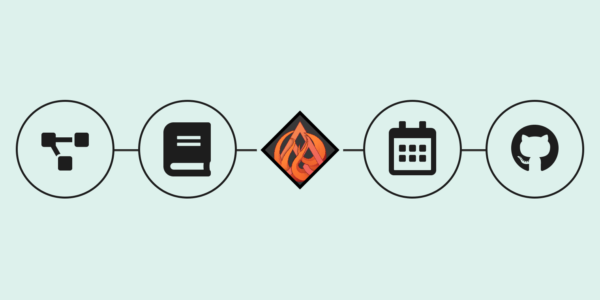

# The Palantir

The Palantir gathers all the informations of your projects and supervises them in the same place.

---

## Goals

### Gathering

When you have many projects, it's hard to keep track on every documentation, changes and some key information from them.
The Palantir collects these informations and offers a user interface that makes it easy to navigate between them.

### Dashboards

Display and monitor all aspects of your projects through the dashboard system.
The live dashboards are automatically updated and can alert you with sounds and animations.

### Modular

The configuration system lets your create your own Palantir in one single JSON file.
You can declare apps, menus, automated tasks and more.

## Up next

  

    <a href="USE.md">
      
      <h3 summary="false" id="use">Use</h3>
      <h4 summary="false" id="deploy-your-own-palantir">Deploy your own Palantir</h4>
    </a>
  

  

    <a href="CONFIGURE.md">
      
      <h3 summary="false" id="configure">Configure</h3>
      <h4 summary="false" id="define-your-apps">Define your apps</h4>
    </a>
  

  

    <a href="CONTRIBUTE.md">
      
      <h3 summary="false" id="contribute">Contribute</h3>
      <h4 summary="false" id="help-wanted">Help wanted</h4>
    </a>
  

  

    <a href="USER-INTERFACE.md.md">
      
      <h3 summary="false" id="user-interface">User interface</h3>
      <h4 summary="false" id="how-the-palantir-works">How the Palantir works</h4>
    </a>
  

  

    <a href="APPS.md">
      
      <h3 summary="false" id="apps">Apps</h3>
      <h4 summary="false" id="use-and-configure">Use and configure</h4>
    </a>
  

  

    <a href="CLI.md">
      
      <h3 summary="false" id="tools">Tools</h3>
      <h4 summary="false" id="interact-with-the-cli">Interact with the CLI</h4>
    </a>
  

